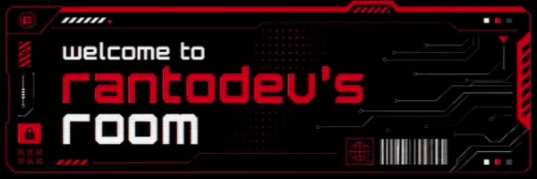

  

  
#  ranto-dev05! ⚙️

Automating Processes 💻 | Simulating Networks 🛡️ | Optimizing Architectures ☁️

Computer Engineering & Informatics student focused on software development, data structures and cybersegurity.

---
## 🤝 Let's Team Up!

Ready to collaborate on software design? Connect here:

  
  
  

---

## 🖥️ Professional Profile
Focus on technical rigor and programming logic. Academic and practical training oriented toward backend architecture, database implementation, and network design, ensuring software quality through clear architectural planning.
- 🌱 **Currently Learning:** Python, Java, C++, Git, Bash.
- 🎯 **Objective:** Build web applications, data automations, and architectural software solutions.

## 🛠️ Tech Stack 
Technical toolkit for software engineering, system scripting, and infrastructure management:

  

---

## 📊 GitHub Stats & Grind
<table border="0">
  <tr>
    <td></td>
    <td></td>
  </tr>
</table>

<table>
  <tr>
    <td width="100%"></td>
  </tr>
</table>

---

## 🧪 Projects & Quests

*   🌐 **TechNova Ltda Network Simulation**: Design and implementation of a hierarchical network infrastructure (distribution and access layers) using Cisco Packet Tracer, validated through strict verification command workflows.
*   📚 **Python Study Bitacora (WORK IN PROGRESS!)**: A structured learning repository on GitHub designed to document advanced logic foundations, exercises, and study milestones.
*   **Discord bot from HackTheWorld Comunnity:** (Soon... ;) )

---

## 🎯 My Mission & Endgame

*   ⏳ **Grinding Now:** Mastering data structures, refining Object-Oriented Programming (OOP) architectures, and studying network simulations.
*   🔮 **Ultimate Quest:** Building robust web applications, data automations, and exploring emerging paradigms like Edge AI, robotics, and hardware optimization.
*   ⚔️ **Side Quests:** Enhancing technical documentation rigor, improving professional English summaries, and preparing for high-level professional internships.

<!-- Proudly created with GPRM ( https://gprm.itsvg.in ) -->
